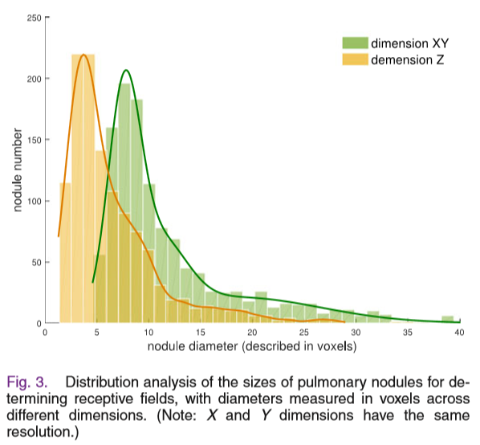
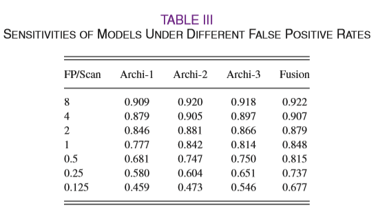

# 论文解析

## 一、INTRODUCTION
1. **自动肺结节检测系统主要包括两个步骤：**
    - 候选结节检测 (sensitivity(recall)要高)
    - 假阳性衰减 (难点：结节大小形状各异且与肺部其他组织相似)
2. **相关研究：**

    - 《A new computationally efficient cad system for pulmonary nodule detection in ct imagery》   
        >方法：形状、位置、密度和梯度特征集合  
        >结果： 82.66%灵敏性，平均每个scan 3个假阳性

    - 《Automatic detection of subsolid pulmonary nodules in thoracic computed tomography images》  
        >方法：密度、形状、纹理特征和引入背景信息  
        >结果：80% 灵敏性，平均每个scan 1个假阳性

    - 《Pulmonary nodule detection in ct images:false positive reduction using multi-view convolutional networks》  
        >方法：多角度2D CNN方法  
        >结果：85.4%灵敏度，平均每个scan 1个假阳性

3. **本文贡献：**  
    - 提出一种利用3D-CNNs进行肺结节检测的新方法，与2D相比3D可以利用到更丰富的空间信息。
    - 考虑到肺实质内部的复杂环境，提出了一种简单有效的策略来利用多级上下文信息。

## 二、METHODOLOGY
  
### 2.1 3D-CNNs结构
#### 2.1.1 3-D Convolutional Layer
  &#160; &#160; &#160; &#160;为了构建3D-CNN，首先需要定义一系列小的3D kernel; 然后添加偏置项,使用非线性激活函数。
    
其中：  
> - h_l_i 和 h_l-1_k分别代表第l层的第i个3D feature volume、l-1层的第k个3D feature volume
> - W_l_ki是连接h_l_i和h_l-1_k的3D kernel
> - b_i是偏置项；σ 是非线性激活函数
#### 2.1.2 3-D Max-Pooling Layer
  - 假设L层为卷积层，L+1 为紧随其后的3D池化层。最大池化层接受一个4D输入tensor T=[h_l_1,h_l_2,h_l_3,…h_l_k], 特征空间[X,Y,Z,K], K为kernel数量。
  - 给定池化 kernel 尺寸M 和步长S，池化之后，feature volume减小到 X′=(X−M/S+1)
#### 2.1.3 Fully Connected Layer
   
  其中：
  > - h_f−1 是输入特征向量，从第 f−1层的3D feature volume压平(flatten)而来。
  > - h_f 是第 f 层的输出特征向量（是一个全连接层）
  > - W_f 是权重矩阵
  > - b_f代表偏置项
  > - σ 是激活函数 ReLU
#### 2.1.4 softmax Layer
  &#160; &#160; &#160; &#160;softmax层是3D-CNN的输出层。  
  &#160; &#160; &#160; &#160;  
  &#160; &#160; &#160; &#160;h_l代表最后一层神经元向量，C是类别数。通过上式计算每个类别c的概率，h_c_l是神经元向量的第c个元素。  
  softmax层的激活函数输出都是(0,1)之间的值,并且和为1。
#### 2.1.5 Cost Function
  &#160; &#160; &#160; &#160;对于给定N对3D训练样本集合 (I_1,y_1),…(I_N,y_N) ，其中I_j 是输入立方块，y_j 是对应的真实标签，y^_j 为预测标签，θ代表所有参数。损失函数如下:  
    
  &#160; &#160; &#160; &#160;其中，1{·}代表indicator function; P是I_j属于类别c的概率(即softmax层的输出)
### 2.2 Importance of Receptive Field 
  &#160; &#160; &#160; &#160;肺结节种类繁杂，体现在直径从3mm到30mm，形状和毛玻璃、实性、内部结构、穿孔等特性。除此之外，肺结节周围经常伴有复杂的背景结构。人工设计的特征识别能力十分有限，可能对某一类结节有良好的识别，但是很难扩展到所有种类的结节。  
  &#160; &#160; &#160; &#160;Receptive Field的大小对识别准确率至关重要。RF太小，只有有限的背景信息可以输入网络，会导致预测能力下降并且难以处理直径较大的结节；RF太小，会包含太多噪声。  
  &#160; &#160; &#160; &#160;本文设计了一种多级背景的网络来解决上述问题。
### 2.3  Multilevel Contextual Networks and Model Fusion    
  
&#160; &#160; &#160; &#160;通过分析结节分布来设计RF大小，如下：
> - **Archi-1 :** Receptive Field 20x20x6(voxels)，主要是处理小结节，覆盖了数据集中58%的结节。  
> - **Archi-2 :** Receptive Field 30x30x10(voxels)，处理中等尺寸的结节，覆盖了数据集中85%的结节。  
> - **Archi-3 :** Receptive Field 40x40x26(voxels)，处理中等尺寸的结节，覆盖了数据集中99%的结节。  

&#160; &#160; &#160; &#160;融合三个网络的softmax回归结果。模型 Archi-1预测 Ij属于分类c的概率为P1(y^_j=c|I_j;θ1)(不同的θ)，Archi-2和Archi-3与之类似。  
  
&#160; &#160; &#160; &#160;采用训练集的小部分子集，用网格搜索的方法来确定权重γ_φ(γ1=0.3, γ2=0.4, γ3=0.3)。  
### 2.4 Training Process 
- **数据增强** ：由于数据集中正负样本比例为 490:1,我们对正样本(真的肺结节)进行转换、扭曲增强。转换过程中，对质心坐标每个体素，每个轴在横向平面做90,180，270度扭曲。最后获得了650000个训练样本。  
- **归一化处理** ：我们将放射密度剪切（类似截断的正态分布之类）到(-1000，400)HU单位之间，并将它们归一化到(0,1)  
- **参数设置** ：权重使用高斯分布 N(0,0.0012) 的随机初始化，并使用标准后向传播更新。学习率初始为0.3，每5000次迭代衰减5%（较大的学习率，因为网络是从头开始训练）。mini-batch为200，momentum系数设置为0.9，dropout应用到卷积层和全连接层，比例为0.2。  
- **训练** ：三个网络独立训练和验证，每个网络训练消耗6小时(GPU Nvidia TITAN Z)

## 三、 EXPERIMENTS 
### 3.1 Dataset and Candidate Generation 
&#160; &#160; &#160; &#160;比赛数据从[publicly available Lung Image Database Consortium (LIDC)](https://www.ncbi.nlm.nih.gov/pmc/articles/PMC3041807/)筛选出888张CT。CT图像横向为515×512分辨率，元素空间0.74×0.74mm²，同时slices厚度小于2.5mm。肺结节数据由经验丰富的外科医生标注位置，只保留了 1186个半径大于3mm的候选（4个外科医生中至少有3个标注了的）未包括在参考标准中的注释，即非结节，结节<3 mm，仅由一个或两个放射科医师注释的结节。
&#160; &#160; &#160; &#160;在本次挑战中，组织者给参赛者提供了一套预先筛选出的候选结节。候选结节是通过三个现有算法检测到的551065个候选结节，检测召回率达到94.4%（1120/1186）。
### 3.2 Evaluations Metrics 
&#160; &#160; &#160; &#160;如果预测的候选位置位于真实结节中心的半径内，则将其计为真阳性。在评估中忽略了对不相关结果的检测（即，既不认为是假阳性也不认为是真阳性）。挑战组织者通过参与团队提交的原始预测概率的不同阈值来执行免费接收器操作特征（FROC）分析。
### 3.3 Results of the Challenge 
  
  
