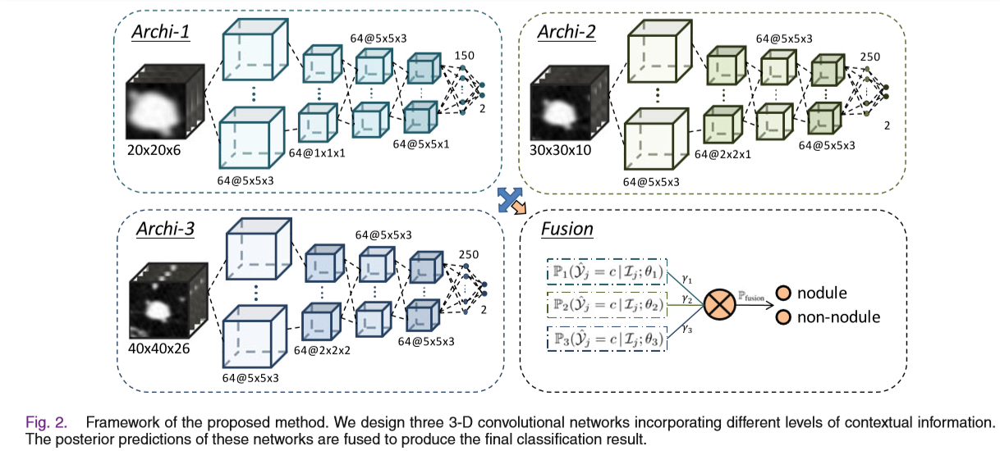

# 论文解析

## 一、INTRODUCTION
1. **自动肺结节检测系统主要包括两个步骤：**
    - 候选结节检测 (sensitivity(recall)要高)
    - 假阳性衰减 (难点：结节大小形状各异且与肺部其他组织相似)
2. **相关研究：**

    - 《A new computationally efficient cad system for pulmonary nodule detection in ct imagery》   
        >方法：形状、位置、密度和梯度特征集合  
        >结果： 82.66%灵敏性，平均每个scan 3个假阳性

    - 《Automatic detection of subsolid pulmonary nodules in thoracic computed tomography images》  
        >方法：密度、形状、纹理特征和引入背景信息  
        >结果：80% 灵敏性，平均每个scan 1个假阳性

    - 《Pulmonary nodule detection in ct images:false positive reduction using multi-view convolutional networks》  
        >方法：多角度2D CNN方法  
        >结果：85.4%灵敏度，平均每个scan 1个假阳性

3. **本文贡献：**  
    - 提出一种利用3D-CNNs进行肺结节检测的新方法，与2D相比3D可以利用到更丰富的空间信息。
    - 考虑到肺实质内部的复杂环境，提出了一种简单有效的策略来利用多级上下文信息。

## 二、METHODOLOGY

### 2.1 3D-CNNs结构
#### 2.1.1 3-D Convolutional Layer
  为了构建3D-CNN，首先需要定义一系列小的3D kernel; 然后添加偏置项,使用非线性激活函数。
  
其中：  
> - h_l_i 和 h_l-1_k分别代表第l层的第i个3D feature volume、l-1层的第k个3D feature volume
> - W_l_ki是连接h_l_i和h_l-1_k的3D kernel
> - b_i是偏置项；σ 是非线性激活函数
#### 2.1.2 3-D Max-Pooling Layer
  - 假设L层为卷积层，L+1 为紧随其后的3D池化层。最大池化层接受一个4D输入tensor T=[h_l_1,h_l_2,h_l_3,…h_l_k], 特征空间[X,Y,Z,K], K为kernel数量。
  - 给定池化 kernel 尺寸M 和步长S，池化之后，feature volume减小到 X′=(X−M/S+1)
#### 2.1.3 Fully Connected Layer
  
  其中：
  > - h_f−1 是输入特征向量，从第 f−1层的3D feature volume压平(flatten)而来。
  > - h_f 是第 f 层的输出特征向量（是一个全连接层）
  > - W_f 是权重矩阵
  > - b_f代表偏置项
  > - σ 是激活函数 ReLU
#### 2.1.4 softmax Layer

  